# Network NOC Monitor

Network NOC Monitor documents a small, self-managed path for securely reaching a Linux device and preparing Grafana Cloud to receive its monitoring metrics. The screenshots in [`docs/images`](docs/images/) walk through the setup shown here.

> **Documentation scope:** The repository currently contains setup screenshots only. It does not include an exporter, Grafana dashboard, alert rules, or application code that sends metrics. Those pieces must be installed and configured separately.

## What you will set up

1. A Tailscale account and a Linux device joined to its tailnet.
2. Tailscale SSH access on that device.
3. A Grafana Cloud stack with a Prometheus metrics destination and an API token.

Tailscale provides private connectivity to the device. Grafana Cloud is the metrics destination. The captured workflow does not show the device exporting or sending metrics to Grafana, so completing these steps alone does not produce monitoring data.

## Prerequisites

- A Linux device you administer, with a working internet connection and `sudo` access. The screenshots use a Raspberry Pi running Raspberry Pi OS, but do not establish compatibility with every distribution.
- A web browser and accounts for GitHub (used for Tailscale sign-in in the screenshots), Tailscale, and Grafana Cloud.
- Permission to authorize the device in your Tailscale network and create Grafana access-policy tokens.

## 1. Create or access a Tailscale account

The screenshots show Tailscale's GitHub authorization and first-run questions. Sign in with an account you control and complete the onboarding prompts. The selected onboarding answers are personal choices and are not required by this guide.


## 2. Install Tailscale and join the Linux device

On the Linux device, install Tailscale using the official installation instructions for your distribution. The screenshot shows the official install script being run from a terminal:

```bash
curl -fsSL https://tailscale.com/install.sh | sh
```

Review third-party installation scripts before running them, and use Tailscale's current official instructions if the command or supported operating systems have changed.

After installation, start the login flow:

```bash
sudo tailscale up
```

Open the one-time URL printed by the command, sign in, and approve the device for your tailnet. The URL is unique to the login session; do not share it.


In the Tailscale admin console, confirm the device appears as connected. The example device is named `delta`; yours may have a different name and address.


## 3. Enable Tailscale SSH

On the device, enable Tailscale SSH:

```bash
sudo tailscale set --ssh
```

The screenshot shows the command returning to the shell without an error. Review your tailnet's access controls and Tailscale SSH policy so only intended users can connect.


## 4. Create a Grafana Cloud stack

Create or sign in to a Grafana Cloud account, complete the account setup, and select a deployment region that meets your operational and data-location needs. Then choose the server or VM monitoring path, or skip the recommendations to open the full Grafana interface.


## 5. Prepare a Prometheus metrics destination

From Grafana Cloud, open the Prometheus onboarding flow. The screenshots choose the managed Prometheus stack and show custom setup options, then select **Send Metrics over HTTP** as the connection method.


## 6. Generate an API token

In the HTTP Metrics configuration, select the metrics format required by your sender (the screenshot has **Otel** selected). Create an access-policy token with the write scope needed for your telemetry. The captured form includes `metrics:write`, `logs:write`, `traces:write`, and `profiles:write`; grant only the scopes your sender actually requires.

The screenshots show the token-creation form and confirmation. A token is a secret: copy it when Grafana displays it, store it in a secrets manager or protected environment variable, and never commit it to this repository, a dashboard, or a screenshot. The images do not show a token value.


## 7. Install the local Prometheus exporters

The remaining screenshots configure a Raspberry Pi running Debian/Raspberry Pi OS as the Prometheus server. Connect to it with Tailscale SSH (or a local terminal) and install Prometheus, Node Exporter, and Blackbox Exporter:

```bash
sudo apt update
sudo apt install prometheus prometheus-node-exporter prometheus-blackbox-exporter
```

The package names and service names below match the Debian-based system in the screenshots. Confirm the package names for other distributions before using these commands. The screenshots show both exporters running as systemd services; check them with:

```bash
sudo systemctl status prometheus
sudo systemctl status prometheus-node-exporter
sudo systemctl status prometheus-blackbox-exporter
```

Check that the exporters expose metrics locally before configuring Prometheus:

```bash
curl http://localhost:9100/metrics
curl http://localhost:9115/metrics
```

Node Exporter reports host metrics on port `9100`. Blackbox Exporter exposes its own metrics on port `9115`; Prometheus uses its `/probe` endpoint to test the hosts listed below. If a service is not active, inspect its logs with `sudo journalctl -u <service> -e` and resolve that before continuing.

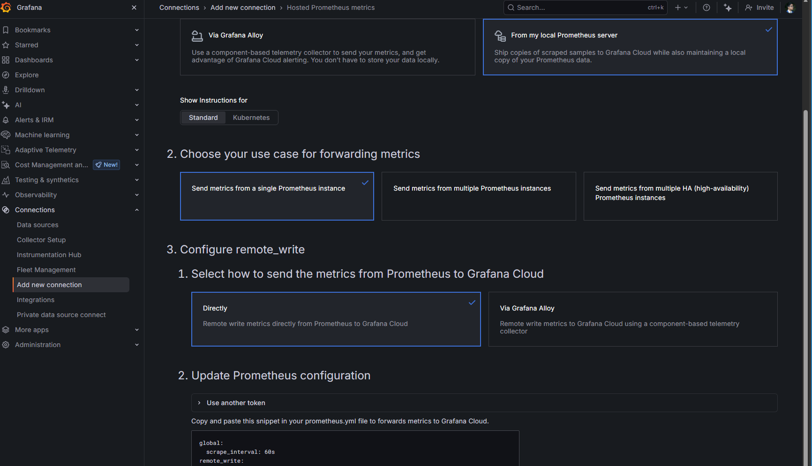

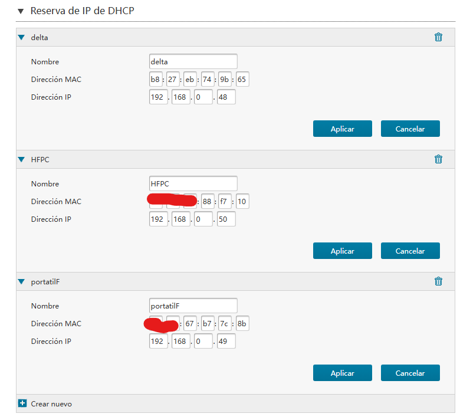

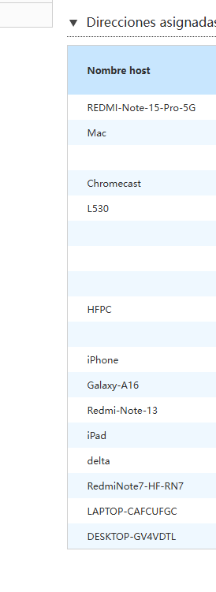

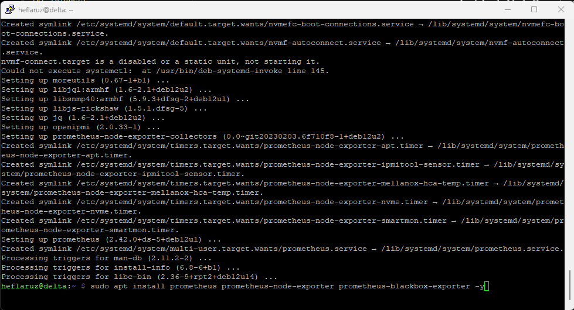

## 8. Configure Tailscale metrics and Blackbox ICMP probes

The screenshots verify that Tailscale metrics are available at `http://100.100.100.100/metrics` from the Raspberry Pi. Check that endpoint on your device:

```bash
curl http://100.100.100.100/metrics
```

If it does not respond, configure Tailscale's metrics listener for your installed version and restrict access to the tailnet as appropriate. Do not expose the metrics listener to the public internet. The `100.100.100.100` address is the Tailscale service address used in the captured setup; verify it in your environment before adding it as a scrape target.

Blackbox Exporter needs an ICMP module. The repository includes [`docs/blackbox.yml`](docs/blackbox.yml) for this setup. The Debian package normally reads `/etc/prometheus/blackbox.yml`; copy the example there, or merge its `icmp` module with the existing configuration if you already use other modules:

```yaml
modules:
  icmp:
    prober: icmp
    timeout: 5s
    icmp:
      preferred_ip_protocol: ip4
```

Restart the exporter after changing its configuration and confirm it is active:

```bash
sudo systemctl restart prometheus-blackbox-exporter
sudo systemctl status prometheus-blackbox-exporter
```

To install the repository example on the Pi, run `sudo cp docs/blackbox.yml /etc/prometheus/blackbox.yml` from a checkout of this repository on that device, before restarting the service.

ICMP probes require permission to create ping sockets. If probes fail, check the exporter logs and the package's service permissions before changing system capabilities. Some networks and devices block ping; a failed probe can therefore mean ICMP is filtered, not that the host is entirely offline.

## 9. Configure Prometheus scraping and remote write

Use [`docs/prometheus.yml`](docs/prometheus.yml) as the starting configuration. It scrapes Node Exporter, Tailscale, and the ICMP results produced by Blackbox Exporter, then forwards scraped metrics to Grafana Cloud. Edit the file on the Raspberry Pi at `/etc/prometheus/prometheus.yml` (the repository copy is a template):

```bash
sudo nano /etc/prometheus/prometheus.yml
```

In Grafana Cloud, use the Prometheus metrics details to obtain the remote-write URL and instance ID. Replace `https://prometheus-xxx.grafana.net/api/prom/push` and `TU_INSTANCE_ID` in the YAML with those values. The password must be a Grafana Cloud access-policy token with the `metrics:write` scope. Keep it private: do not commit a real token or paste it into screenshots. The `Otel` format selected in the earlier onboarding screenshot is not the format for this Prometheus `remote_write` configuration; follow the Prometheus connection details shown for the hosted Prometheus service.

Replace the example Blackbox targets with the IP addresses or DNS names of devices that should answer ICMP on your LAN. The screenshots show DHCP reservations for `delta` (`192.168.0.48`), `HFPC` (`192.168.0.50`) and `portatilF` (`192.168.0.49`), along with router address `192.168.0.1` and names such as `Mac.local`, `Redmi-Note-13.local`, and `ipad.local`. These are examples from the captured network, not universal addresses. Prefer DHCP reservations or stable DNS names so targets do not change unexpectedly. Remove devices that should not be monitored, and confirm the Raspberry Pi can resolve each name and reach each address.

The repository template uses the Tailscale endpoint as the `tailscale` scrape target and `localhost:9115` as the Blackbox Exporter. If Prometheus runs on a different host, update those addresses. Validate the configuration and restart Prometheus:

```bash
promtool check config /etc/prometheus/prometheus.yml
sudo systemctl restart prometheus
sudo systemctl status prometheus
```

Open `http://<IP-DE-LA-RASPBERRY-PI>:9090/targets` from a device that can reach the Pi, or use the local Prometheus interface. Wait at least one scrape interval and confirm each expected target reports `UP`. The screenshots also verify `up` from Grafana Cloud's Prometheus query interface.

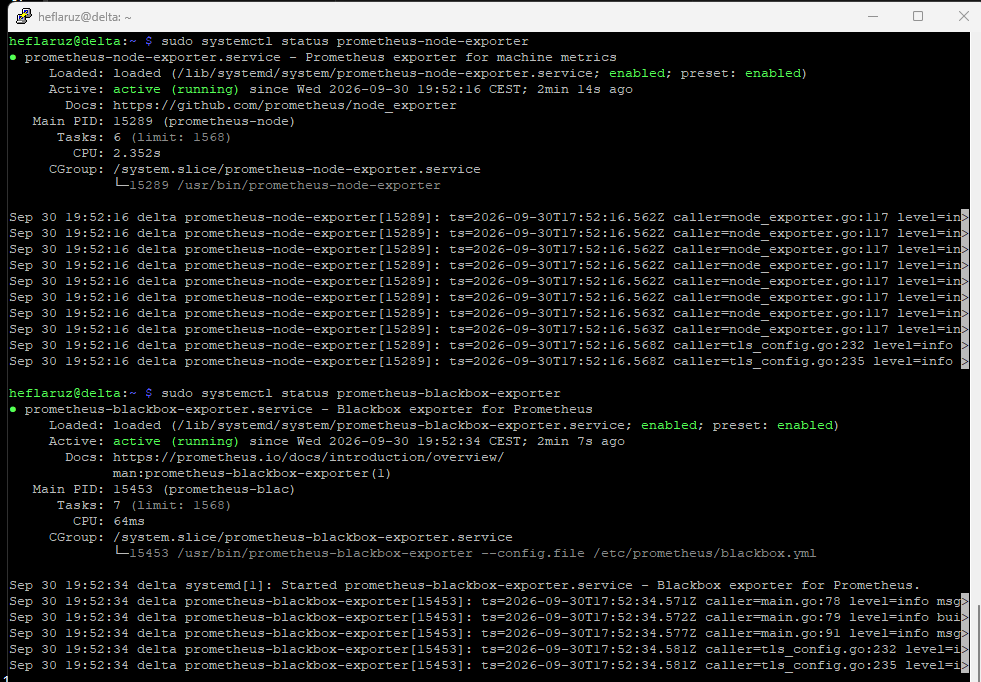

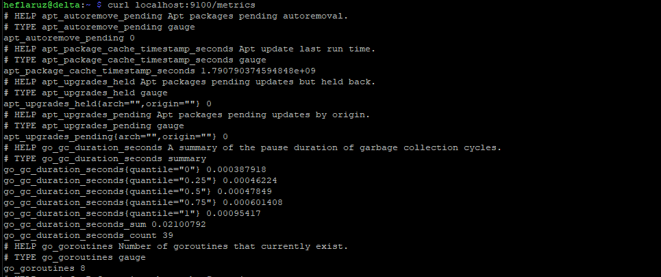

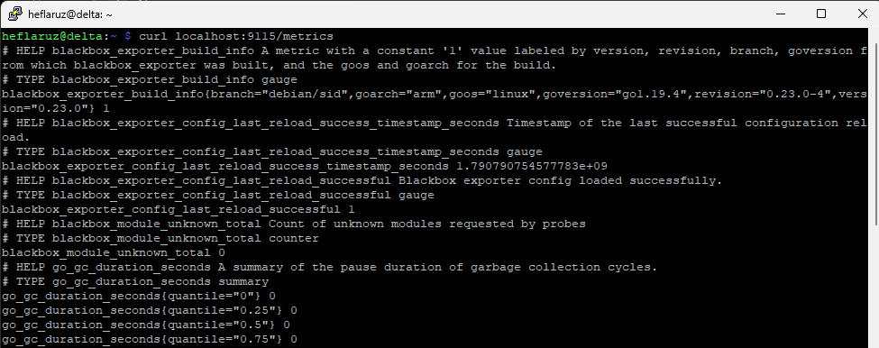

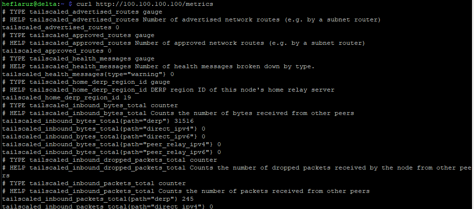

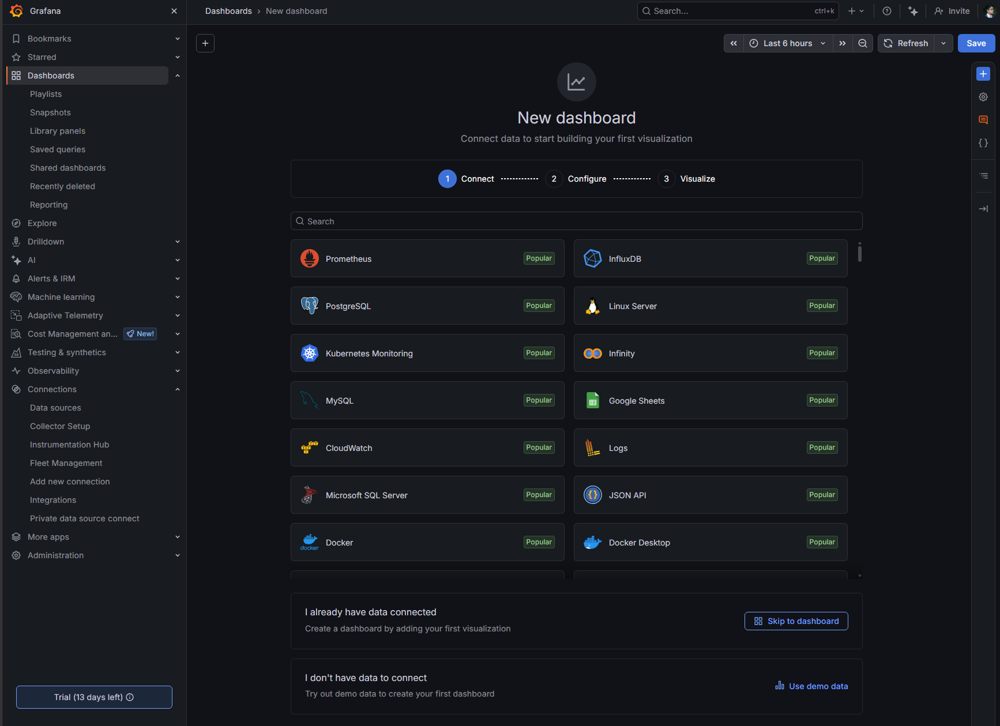

## 10. Create a basic availability panel in Grafana

The final screenshots begin a dashboard named `noc-monitor` and configure a **Bar gauge** panel titled `Uptime % - Dispositivos de red`. In Grafana, create a dashboard, add a panel, choose the Grafana Cloud Prometheus data source, and enter this PromQL query in Code mode:

```promql
avg_over_time(probe_success[$__range]) * 100
```

Choose **Bar gauge** as the visualization, set the panel title, and save the panel and dashboard. This query shows the percentage of successful ICMP probes over the selected dashboard time range. A value of `0` means no successful probes were recorded in that range; check the device's ICMP policy and the `probe_success` series before interpreting it as a complete outage. The screenshot shows the panel editor and save dialog, but not a completed saved dashboard.

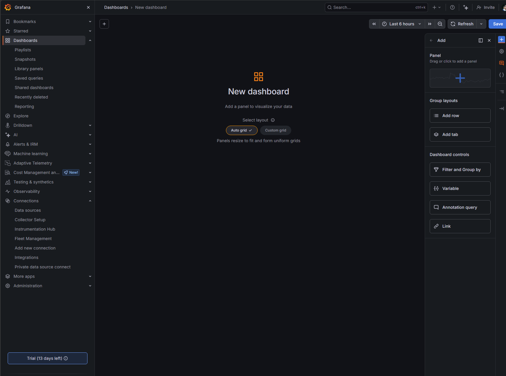

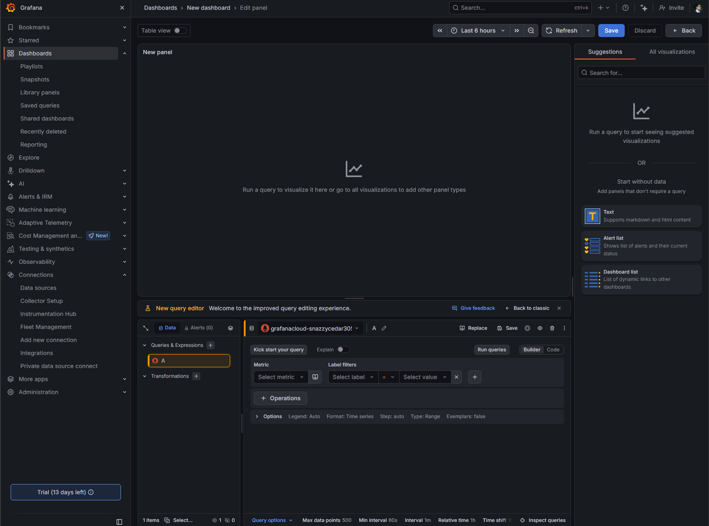

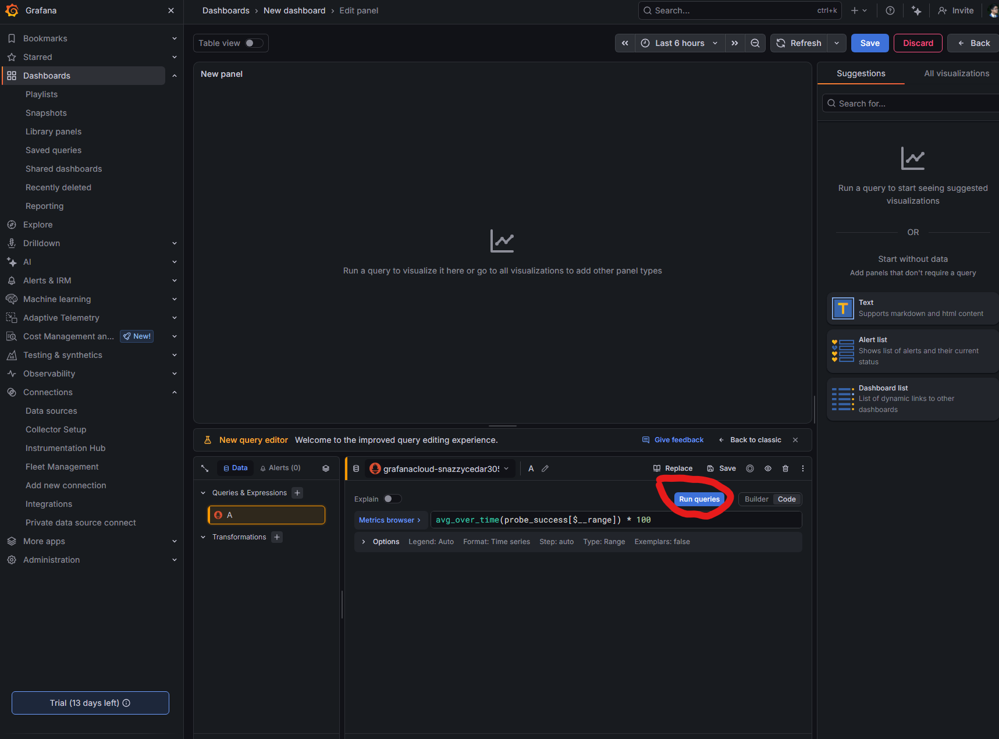

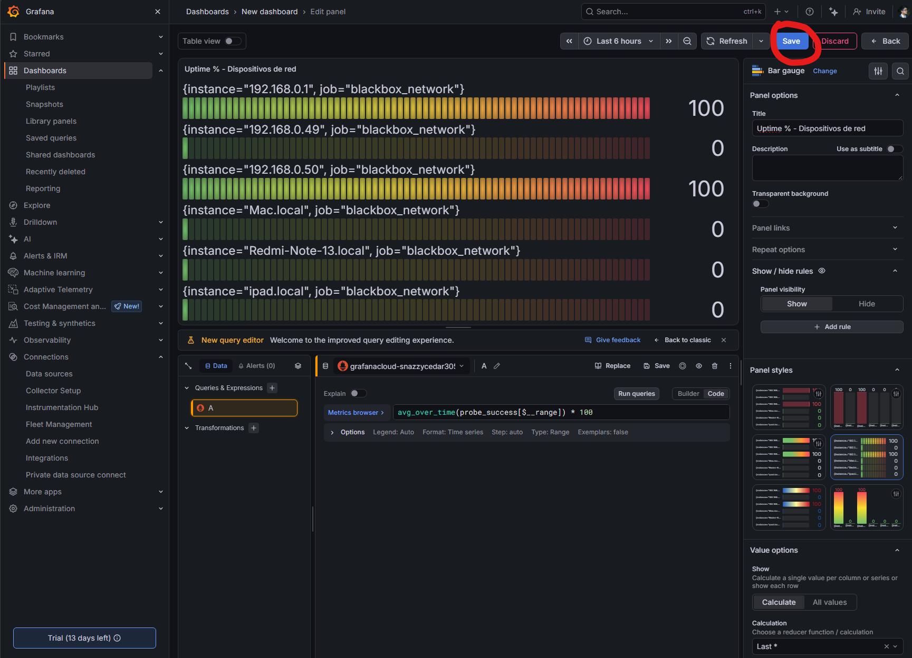

## Troubleshooting checklist

- If a target is absent in Grafana, verify its Prometheus target is `UP` and that `remote_write` is configured with the correct URL, instance ID, and token.
- If Blackbox targets are `DOWN`, test DNS resolution and ICMP reachability from the Pi, then inspect `prometheus-blackbox-exporter` logs and its ICMP module configuration.
- If Node Exporter is absent, verify `prometheus-node-exporter` is active and `localhost:9100/metrics` responds on the Prometheus host.
- After editing either YAML file, validate Prometheus configuration with `promtool check config` and review the relevant systemd service status and logs.
- Treat `docs/prometheus.yml` as an example: substitute credentials and network targets for your environment before deploying it.


## Screenshot index

All screenshots are stored in [`docs/images`](docs/images/). Screenshots 1–18 document account setup, device enrollment, Grafana Cloud onboarding, and token creation. Screenshots 19–30 show exporter installation, endpoint checks, LAN addressing, Prometheus configuration, and a successful query. Screenshots 31–36 show the start of a Grafana dashboard and availability panel configuration.

## License

See [LICENSE](LICENSE).
