# Network NOC Monitor

Network NOC Monitor documents a small, self-managed path for securely reaching a Linux device and preparing Grafana Cloud to receive its monitoring metrics. The screenshots in [`docs/images`](docs/images/) walk through the setup shown here.

> **Documentation scope:** The repository currently contains setup screenshots only. It does not include an exporter, Grafana dashboard, alert rules, or application code that sends metrics. Those pieces must be installed and configured separately.

## What you will set up

1. A Tailscale account and a Linux device joined to its tailnet.
2. Tailscale SSH access on that device.
3. A Grafana Cloud stack with a Prometheus metrics destination and an API token.

Tailscale provides private connectivity to the device. Grafana Cloud is the metrics destination. The captured workflow does not show the device exporting or sending metrics to Grafana, so completing these steps alone does not produce monitoring data.

## Prerequisites

- A Linux device you administer, with a working internet connection and `sudo` access. The screenshots use a Raspberry Pi running Raspberry Pi OS, but do not establish compatibility with every distribution.
- A web browser and accounts for GitHub (used for Tailscale sign-in in the screenshots), Tailscale, and Grafana Cloud.
- Permission to authorize the device in your Tailscale network and create Grafana access-policy tokens.

## 1. Create or access a Tailscale account

The screenshots show Tailscale's GitHub authorization and first-run questions. Sign in with an account you control and complete the onboarding prompts. The selected onboarding answers are personal choices and are not required by this guide.

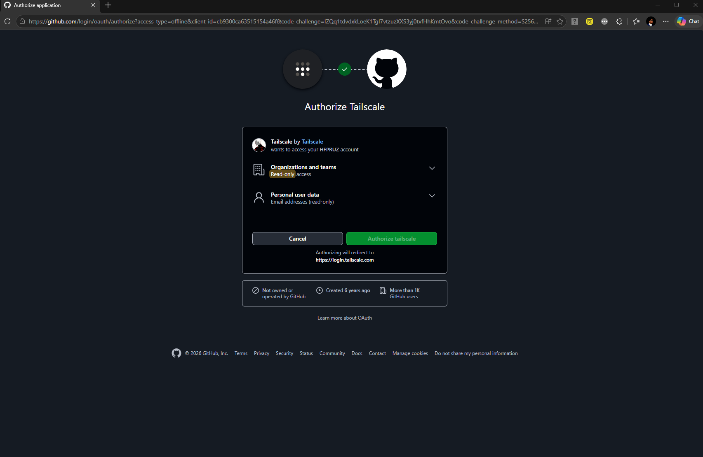

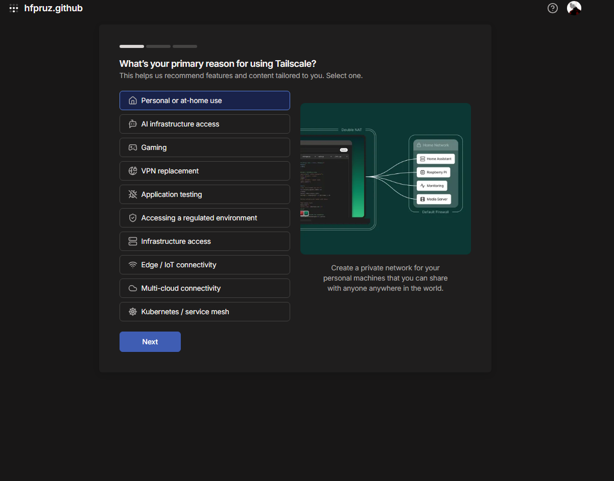

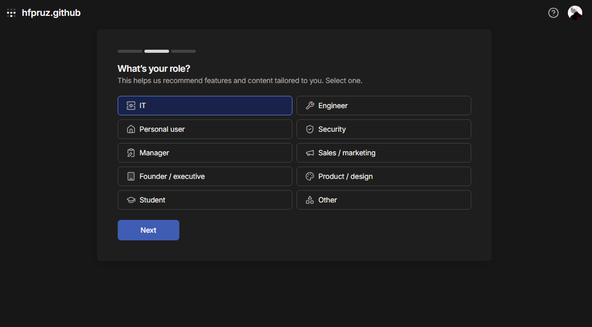

## 2. Install Tailscale and join the Linux device

On the Linux device, install Tailscale using the official installation instructions for your distribution. The screenshot shows the official install script being run from a terminal:

```bash
curl -fsSL https://tailscale.com/install.sh | sh
```

Review third-party installation scripts before running them, and use Tailscale's current official instructions if the command or supported operating systems have changed.

After installation, start the login flow:

```bash
sudo tailscale up
```

Open the one-time URL printed by the command, sign in, and approve the device for your tailnet. The URL is unique to the login session; do not share it.

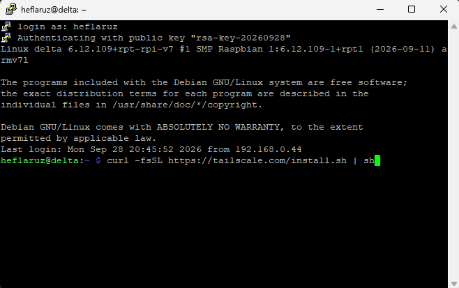

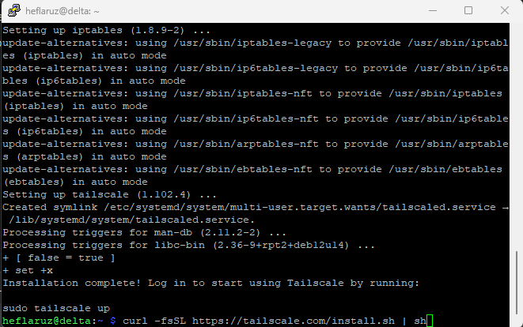

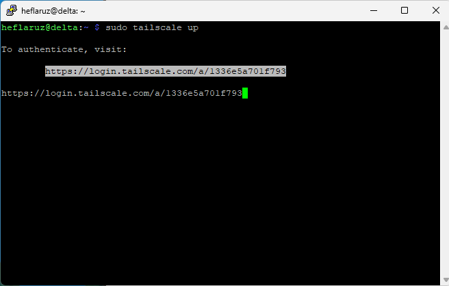

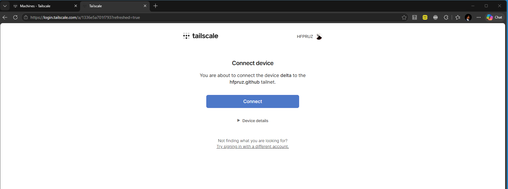

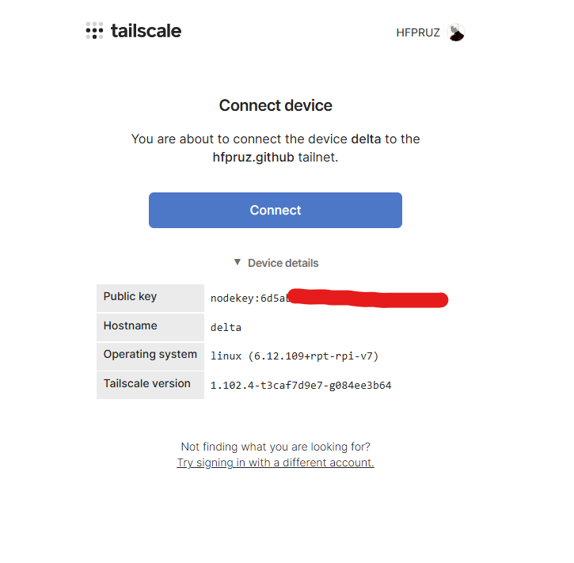

In the Tailscale admin console, confirm the device appears as connected. The example device is named `delta`; yours may have a different name and address.

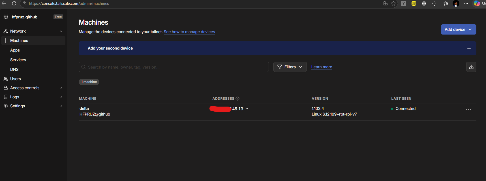

## 3. Enable Tailscale SSH

On the device, enable Tailscale SSH:

```bash
sudo tailscale set --ssh
```

The screenshot shows the command returning to the shell without an error. Review your tailnet's access controls and Tailscale SSH policy so only intended users can connect.

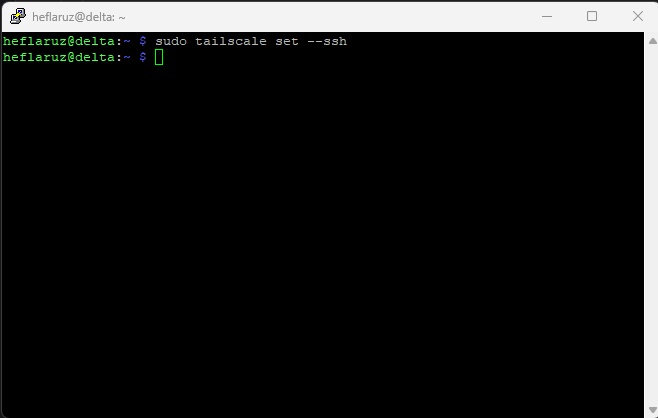

## 4. Create a Grafana Cloud stack

Create or sign in to a Grafana Cloud account, complete the account setup, and select a deployment region that meets your operational and data-location needs. Then choose the server or VM monitoring path, or skip the recommendations to open the full Grafana interface.

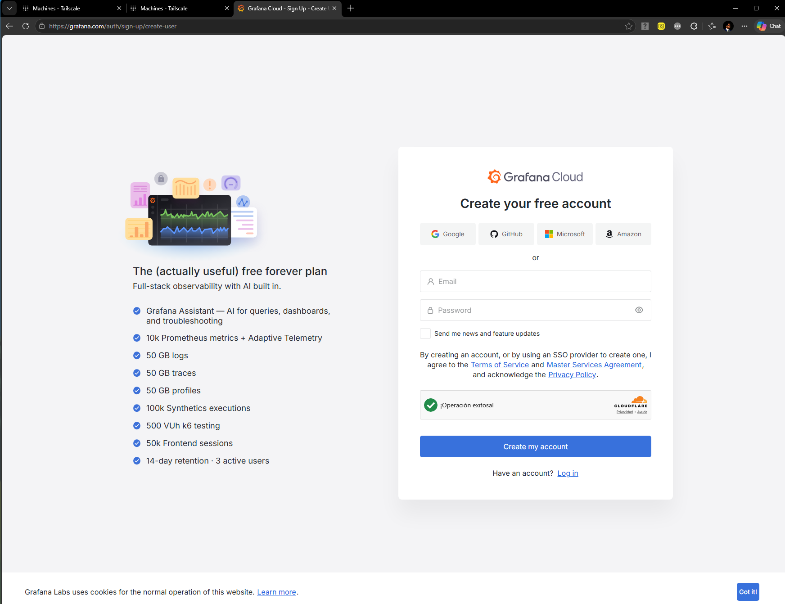

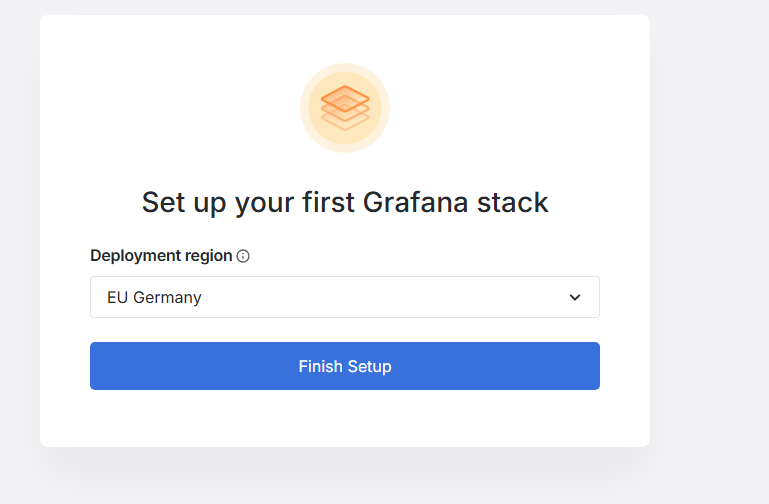

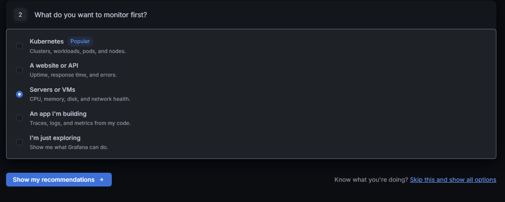

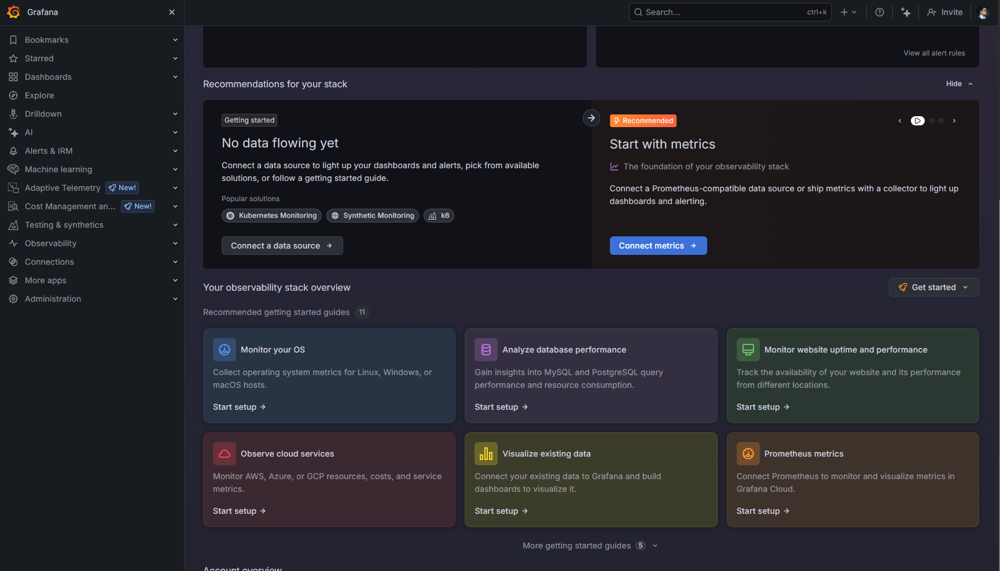

## 5. Prepare a Prometheus metrics destination

From Grafana Cloud, open the Prometheus onboarding flow. The screenshots choose the managed Prometheus stack and show custom setup options, then select **Send Metrics over HTTP** as the connection method.

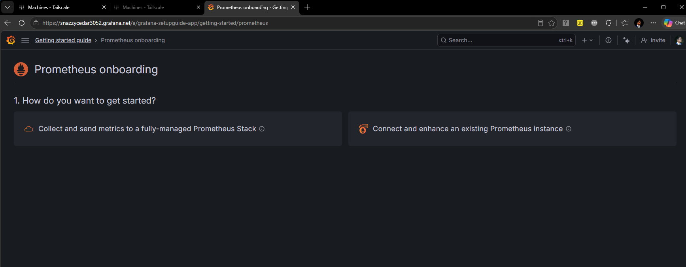

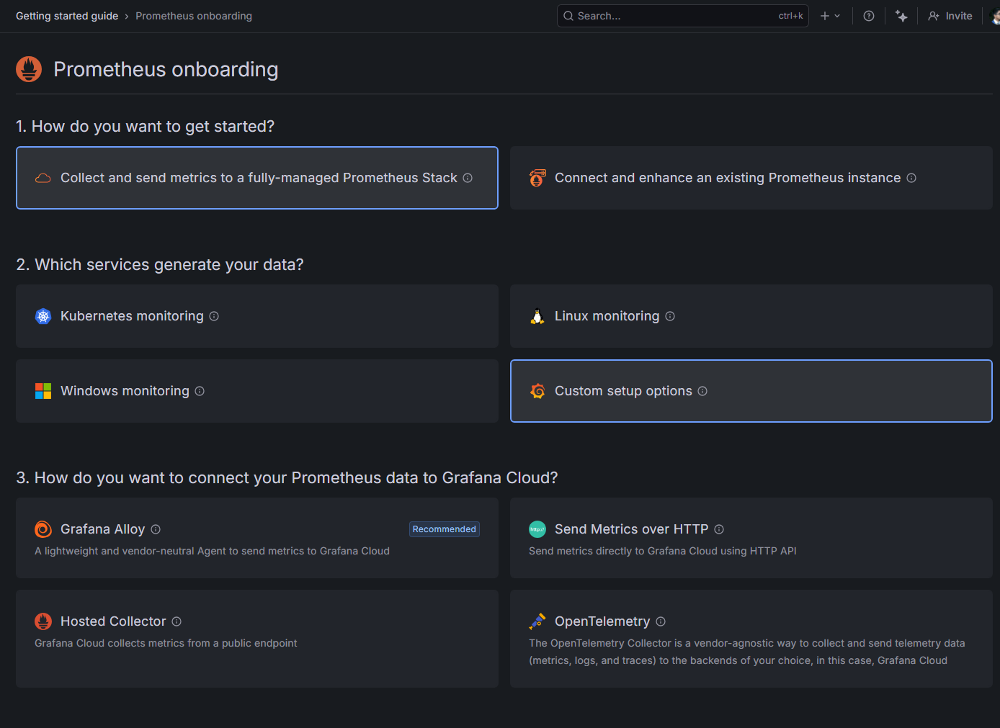

## 6. Generate an API token

In the HTTP Metrics configuration, select the metrics format required by your sender (the screenshot has **Otel** selected). Create an access-policy token with the write scope needed for your telemetry. The captured form includes `metrics:write`, `logs:write`, `traces:write`, and `profiles:write`; grant only the scopes your sender actually requires.

The screenshots show the token-creation form and confirmation. A token is a secret: copy it when Grafana displays it, store it in a secrets manager or protected environment variable, and never commit it to this repository, a dashboard, or a screenshot. The images do not show a token value.

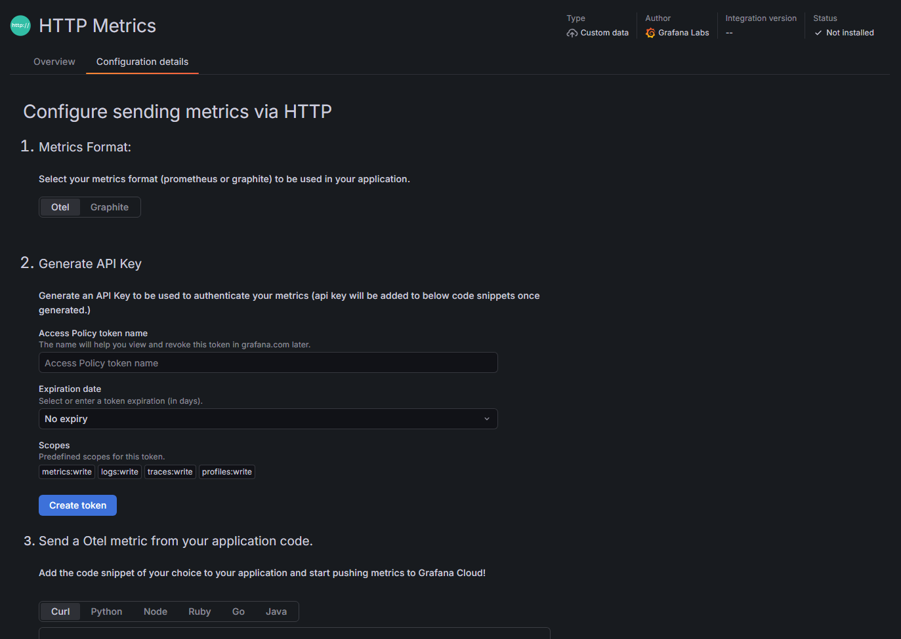

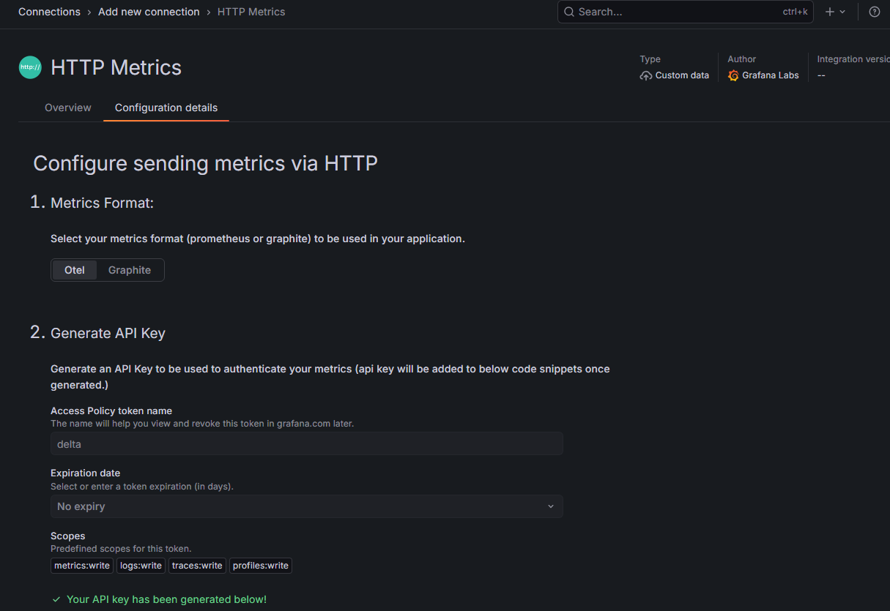

## Next step: send metrics

Use the endpoint, authentication details, and code or agent configuration displayed by your Grafana Cloud stack to configure a Prometheus-compatible sender on the device. Keep the token private and verify that the sender can reach Grafana Cloud. Then query the expected metrics in Grafana Explore or a dashboard.

The repository screenshots end at token creation and do not provide a sender configuration, endpoint, dashboard, alert rules, or validation procedure. These values depend on your Grafana stack and the exporter or collector you choose, so do not copy credentials or endpoints from someone else's setup.

## Troubleshooting

- **The device does not appear in Tailscale:** Check that `tailscaled` is running and repeat `sudo tailscale up`. Complete authorization in the browser and confirm the device is approved in the admin console.
- **Tailscale SSH is unavailable:** Confirm `sudo tailscale set --ssh` succeeded, then review your tailnet's SSH access rules and user permissions.
- **Grafana shows no data:** Creating a stack and API token does not send metrics. Configure and start a compatible exporter or collector, confirm its destination and token, and inspect its logs for delivery errors.
- **A token may have been exposed:** Revoke it in Grafana Cloud and create a replacement with the minimum required scopes.

## Screenshot index

All screenshots are stored in [`docs/images`](docs/images/). They are referenced inline above in the order of the workflow.

## License

See [LICENSE](LICENSE).
