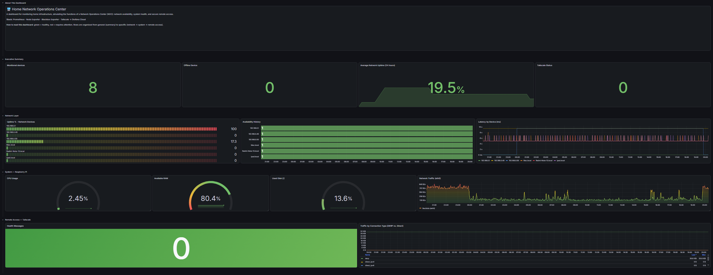
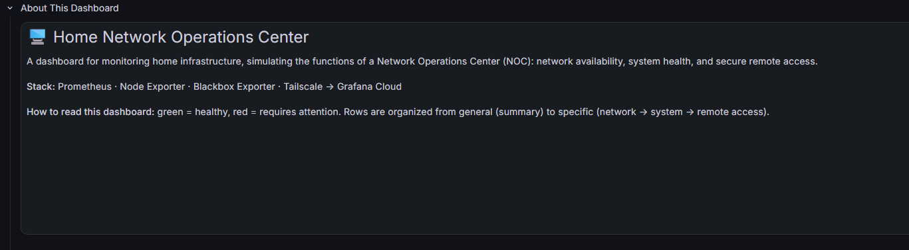
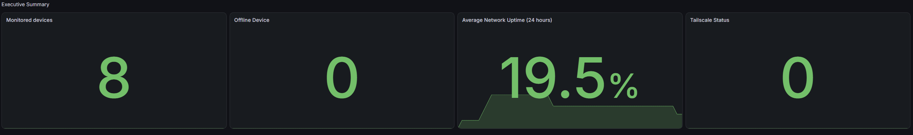
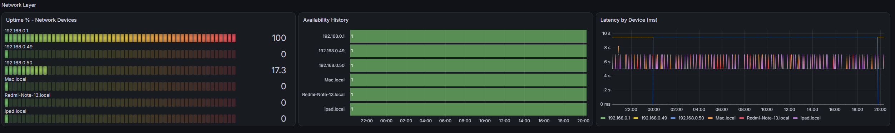
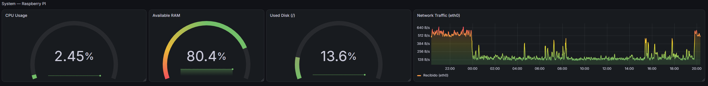
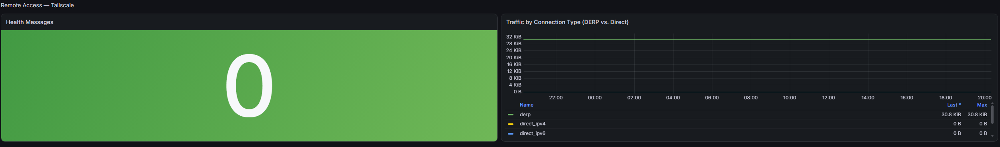

# Network NOC Monitor

Network NOC Monitor documents a self-managed path for securely reaching a Linux device, shipping its metrics to Grafana Cloud, and building a multi-panel operations dashboard on top of them. The screenshots in [`docs/images`](https://github.com/HFPRUZ/network-noc-monitor/blob/main/docs/images) walk through the setup and dashboard build shown here.

## What you will set up

1. A Tailscale account and a Linux device joined to its tailnet, with Tailscale SSH enabled.
2. A Grafana Cloud stack with a Prometheus metrics destination and an API token.
3. Prometheus, Node Exporter, and Blackbox Exporter running on the device, scraping local system metrics, Tailscale client metrics, and ICMP probes of LAN devices.
4. A four-section Grafana dashboard (`noc-monitor`) covering an executive summary, network-layer availability, system health, and remote-access status.

Tailscale provides private connectivity to the device. Grafana Cloud is the metrics destination and dashboard host. The resulting dashboard reflects live data from the device's own OS, its LAN neighbors, and the Tailscale client itself.

## Prerequisites

- A Linux device you administer, with a working internet connection and `sudo` access. The screenshots use a Raspberry Pi 2 Model B (ARMv7, 32-bit) running Raspberry Pi OS Lite, but do not establish compatibility with every distribution or architecture.
- A web browser and accounts for GitHub (used for Tailscale sign-in in the screenshots), Tailscale, and Grafana Cloud.
- Permission to authorize the device in your Tailscale network and create Grafana access-policy tokens.

## 1. Create or access a Tailscale account

The screenshots show Tailscale's GitHub authorization and first-run questions. Sign in with an account you control and complete the onboarding prompts. The selected onboarding answers are personal choices and are not required by this guide.

[](/HFPRUZ/network-noc-monitor/blob/main/docs/images/captura1.png)

[](/HFPRUZ/network-noc-monitor/blob/main/docs/images/captura2.png)

[](/HFPRUZ/network-noc-monitor/blob/main/docs/images/captura3.png)

## 2. Install Tailscale and join the Linux device

On the Linux device, install Tailscale using the official installation instructions for your distribution. The screenshot shows the official install script being run from a terminal:

```
curl -fsSL https://tailscale.com/install.sh | sh
```

Review third-party installation scripts before running them, and use Tailscale's current official instructions if the command or supported operating systems have changed.

After installation, start the login flow:

```
sudo tailscale up
```

Open the one-time URL printed by the command, sign in, and approve the device for your tailnet. The URL is unique to the login session; do not share it.

[](/HFPRUZ/network-noc-monitor/blob/main/docs/images/captura4.png)

[](/HFPRUZ/network-noc-monitor/blob/main/docs/images/captura5.png)

[](/HFPRUZ/network-noc-monitor/blob/main/docs/images/captura6.png)

[](/HFPRUZ/network-noc-monitor/blob/main/docs/images/captura7.png)

[](/HFPRUZ/network-noc-monitor/blob/main/docs/images/captura8.png)

In the Tailscale admin console, confirm the device appears as connected. The example device is named `delta`; yours may have a different name and address.

[](/HFPRUZ/network-noc-monitor/blob/main/docs/images/captura9.png)

## 3. Enable Tailscale SSH

On the device, enable Tailscale SSH:

```
sudo tailscale set --ssh
```

The screenshot shows the command returning to the shell without an error. Review your tailnet's access controls and Tailscale SSH policy so only intended users can connect.

[](/HFPRUZ/network-noc-monitor/blob/main/docs/images/captura10.png)

## 4. Create a Grafana Cloud stack

Create or sign in to a Grafana Cloud account, complete the account setup, and select a deployment region that meets your operational and data-location needs. Then choose the server or VM monitoring path, or skip the recommendations to open the full Grafana interface.

[](/HFPRUZ/network-noc-monitor/blob/main/docs/images/captura11.png)

[](/HFPRUZ/network-noc-monitor/blob/main/docs/images/captura12.png)

[](/HFPRUZ/network-noc-monitor/blob/main/docs/images/captura13.png)

[](/HFPRUZ/network-noc-monitor/blob/main/docs/images/captura14.png)

## 5. Prepare a Prometheus metrics destination

From Grafana Cloud, open the Prometheus onboarding flow. The screenshots choose the managed Prometheus stack and show custom setup options, then select **Send Metrics over HTTP** as the connection method.

[](/HFPRUZ/network-noc-monitor/blob/main/docs/images/captura15.png)

[](/HFPRUZ/network-noc-monitor/blob/main/docs/images/captura16.png)

## 6. Generate an API token

In the HTTP Metrics configuration, select the metrics format required by your sender (the screenshot has **Otel** selected). Create an access-policy token with the write scope needed for your telemetry. The captured form includes `metrics:write`, `logs:write`, `traces:write`, and `profiles:write`; grant only the scopes your sender actually requires.

The screenshots show the token-creation form and confirmation. A token is a secret: copy it when Grafana displays it, store it in a secrets manager or protected environment variable, and never commit it to this repository, a dashboard, or a screenshot. The images do not show a token value.

[](/HFPRUZ/network-noc-monitor/blob/main/docs/images/captura17.png)

[](/HFPRUZ/network-noc-monitor/blob/main/docs/images/captura18.png)

## 7. Install the local Prometheus exporters

The remaining screenshots configure a Raspberry Pi running Debian/Raspberry Pi OS as the Prometheus server. Connect to it with Tailscale SSH (or a local terminal) and install Prometheus, Node Exporter, and Blackbox Exporter:

```
sudo apt update
sudo apt install prometheus prometheus-node-exporter prometheus-blackbox-exporter
```

The package names and service names below match the Debian-based system in the screenshots. Confirm the package names for other distributions before using these commands. The screenshots show both exporters running as systemd services; check them with:

```
sudo systemctl status prometheus
sudo systemctl status prometheus-node-exporter
sudo systemctl status prometheus-blackbox-exporter
```

Check that the exporters expose metrics locally before configuring Prometheus:

```
curl http://localhost:9100/metrics
curl http://localhost:9115/metrics
```

Node Exporter reports host metrics on port `9100`. Blackbox Exporter exposes its own metrics on port `9115`; Prometheus uses its `/probe` endpoint to test the hosts listed below. If a service is not active, inspect its logs with `sudo journalctl -u <service> -e` and resolve that before continuing.

[](/HFPRUZ/network-noc-monitor/blob/main/docs/images/captura19.png)

[](/HFPRUZ/network-noc-monitor/blob/main/docs/images/captura20.png)

[](/HFPRUZ/network-noc-monitor/blob/main/docs/images/captura21.png)

[](/HFPRUZ/network-noc-monitor/blob/main/docs/images/captura22.png)

## 8. Configure Tailscale metrics and Blackbox ICMP probes

The screenshots verify that Tailscale metrics are available at `http://100.100.100.100/metrics` from the Raspberry Pi. Check that endpoint on your device:

```
curl http://100.100.100.100/metrics
```

If it does not respond, enable the client's metrics listener with `sudo tailscale set --webclient` and verify it again. Restrict access to the tailnet as appropriate, and do not expose the metrics listener to the public internet. The `100.100.100.100` address is the Tailscale service address used in the captured setup; verify it in your environment before adding it as a scrape target.

Blackbox Exporter needs an ICMP module. The repository includes [`docs/blackbox.yml`](https://github.com/HFPRUZ/network-noc-monitor/blob/main/docs/blackbox.yml) for this setup. The Debian package normally reads `/etc/prometheus/blackbox.yml`; copy the example there, or merge its `icmp` module with the existing configuration if you already use other modules:

```
modules:
  icmp:
    prober: icmp
    timeout: 5s
    icmp:
      preferred_ip_protocol: ip4
```

Restart the exporter after changing its configuration and confirm it is active:

```
sudo systemctl restart prometheus-blackbox-exporter
sudo systemctl status prometheus-blackbox-exporter
```

To install the repository example on the Pi, run `sudo cp docs/blackbox.yml /etc/prometheus/blackbox.yml` from a checkout of this repository on that device, before restarting the service.

ICMP probes require permission to create ping sockets. If probes fail, check the exporter logs and the package's service permissions before changing system capabilities. Some networks and devices block ping; a failed probe can therefore mean ICMP is filtered, not that the host is entirely offline.

## 9. Configure Prometheus scraping and remote write

Use [`docs/prometheus.yml`](https://github.com/HFPRUZ/network-noc-monitor/blob/main/docs/prometheus.yml) as the starting configuration. It scrapes Node Exporter, Tailscale, and the ICMP results produced by Blackbox Exporter, then forwards scraped metrics to Grafana Cloud. Edit the file on the Raspberry Pi at `/etc/prometheus/prometheus.yml` (the repository copy is a template):

```
sudo nano /etc/prometheus/prometheus.yml
```

In Grafana Cloud, use the Prometheus metrics details to obtain the remote-write URL and instance ID. Replace `https://prometheus-xxx.grafana.net/api/prom/push` and the instance ID placeholder in the YAML with those values. The password must be a Grafana Cloud access-policy token with the `metrics:write` scope. Keep it private: do not commit a real token or paste it into screenshots. The `Otel` format selected in the earlier onboarding screenshot is not the format for this Prometheus `remote_write` configuration; follow the Prometheus connection details shown for the hosted Prometheus service.

Replace the example Blackbox targets with the IP addresses or DNS names of devices that should answer ICMP on your LAN. The screenshots show DHCP reservations for `delta` (`192.168.0.48`), `HFPC` (`192.168.0.50`) and `portatilF` (`192.168.0.49`), along with router address `192.168.0.1` and names such as `Mac.local`, `Redmi-Note-13.local`, and `ipad.local`. These are examples from the captured network, not universal addresses. Prefer DHCP reservations or stable DNS names so targets do not change unexpectedly. Remove devices that should not be monitored, and confirm the Raspberry Pi can resolve each name and reach each address.

The repository template uses the Tailscale endpoint as the `tailscale` scrape target and `localhost:9115` as the Blackbox Exporter. If Prometheus runs on a different host, update those addresses. Validate the configuration and restart Prometheus:

```
promtool check config /etc/prometheus/prometheus.yml
sudo systemctl restart prometheus
sudo systemctl status prometheus
```

Open `http://<raspberry-pi-ip>:9090/targets` from a device that can reach the Pi, or use the local Prometheus interface. Wait at least one scrape interval and confirm each expected target reports `UP`. The screenshots also verify `up` from Grafana Cloud's Prometheus query interface.

[](/HFPRUZ/network-noc-monitor/blob/main/docs/images/captura23.png)

[](/HFPRUZ/network-noc-monitor/blob/main/docs/images/captura24.png)

[](/HFPRUZ/network-noc-monitor/blob/main/docs/images/captura25.png)

[](/HFPRUZ/network-noc-monitor/blob/main/docs/images/captura26.png)

[](/HFPRUZ/network-noc-monitor/blob/main/docs/images/captura30.png)

## 10. Build the Grafana dashboard

The dashboard, named `noc-monitor`, is organized into four rows that move from a general summary to specific operational layers: **Overview**, **Executive Summary**, **Network Layer**, **System — Raspberry Pi**, and **Remote Access — Tailscale**. Every panel below uses the Grafana Cloud Prometheus data source created in step 5 and PromQL entered in Code mode.

[](docs/images/dashboard/dashboard-full.png)

### 10.1 Overview row

A single Markdown **Text** panel (no query) with no title, placed above the other rows, gives first-time viewers context before they reach any numbers:

```markdown
## Home Network Operations Center

A dashboard for monitoring home infrastructure, simulating the functions of a
Network Operations Center (NOC): network availability, system health, and
secure remote access.

**Stack:** Prometheus · Node Exporter · Blackbox Exporter · Tailscale → Grafana Cloud

**How to read this dashboard:** green = healthy, red = requires attention. Rows
are organized from general (summary) to specific (network → system → remote access).
```

[](docs/images/dashboard/overview-row.png)

### 10.2 Executive Summary row

Four **Stat** panels give a single-glance status check:

| Panel | Query | Notes |
|---|---|---|
| Monitored devices | `count(up)` | Total targets Prometheus is scraping |
| Offline Devices | `count(up == 0) or vector(0)` | The `or vector(0)` clause returns `0` instead of "no data" when every target is up |
| Average Network Uptime (24 hours) | `avg(avg_over_time(probe_success[24h])) * 100` | Unit: Percent (0–100) |
| Tailscale Status | `sum(tailscaled_health_messages)` | `0` indicates no active health warnings; threshold set to red above `0` |

[](docs/images/dashboard/executive-summary-row.png)

### 10.3 Network Layer row

Three panels built on Blackbox Exporter's ICMP probe results:

- **Uptime % - Network Devices** (Bar gauge) — `avg_over_time(probe_success[$__range]) * 100`, legend `{{instance}}`
- **Availability History** (State timeline) — `up{job="blackbox_network"}`, legend `{{instance}}`
- **Latency by Device (ms)** (Time series) — `probe_duration_seconds * 1000`, legend `{{instance}}`, unit `milliseconds (ms)`, stacking set to **None**

A `0%` uptime reading for a given device over a 24-hour window generally reflects the device being powered off or disconnected for most of that window (phones, tablets, laptops), not a Prometheus or network fault — cross-check with a direct `ping` before treating it as an incident.

[](docs/images/dashboard/network-layer-row.png)

### 10.4 System — Raspberry Pi row

Four panels built on Node Exporter metrics from the Pi itself:

- **CPU Usage** (Gauge) — `100 - (avg(rate(node_cpu_seconds_total{mode="idle"}[5m])) * 100)`, unit Percent (0–100)
- **Available RAM** (Gauge) — `node_memory_MemAvailable_bytes / node_memory_MemTotal_bytes * 100`, unit Percent (0–100); thresholds are set so **higher available RAM shows green**, not red
- **Used Disk (/)** (Gauge) — `100 - (node_filesystem_avail_bytes{mountpoint="/"} / node_filesystem_size_bytes{mountpoint="/"} * 100)`, unit Percent (0–100)
- **Network Traffic (eth0)** (Time series) — `rate(node_network_receive_bytes_total{device="eth0"}[5m])`, legend set to a fixed label (e.g. `Received (eth0)`) rather than the raw metric labels; replace `eth0` with the correct interface name (e.g. `wlan0`) if the device connects over Wi-Fi

[](docs/images/dashboard/system-row.png)

### 10.5 Remote Access — Tailscale row

Two panels built on the Tailscale client metrics endpoint configured in step 8:

- **Health Messages** (Stat) — `tailscaled_health_messages`, threshold red above `0`
- **Traffic by Connection Type (DERP vs. Direct)** (Time series) — `tailscaled_inbound_bytes_total`, legend `{{path}}`

Traffic consistently reported under the `derp` path (rather than `direct_ipv4` / `direct_ipv6`) indicates the client is relaying through a DERP server instead of a direct peer-to-peer connection — commonly caused by symmetric NAT or a restrictive firewall on one end. This is a configuration detail worth investigating, not necessarily a fault.

[](docs/images/dashboard/remote-access-row.png)

Save the dashboard as `noc-monitor` once all five sections are in place.

## Troubleshooting checklist

- If a target is absent in Grafana, verify its Prometheus target is `UP` and that `remote_write` is configured with the correct URL, instance ID, and token.
- If Blackbox targets are `DOWN`, test DNS resolution and ICMP reachability from the Pi, then inspect `prometheus-blackbox-exporter` logs and its ICMP module configuration.
- If Node Exporter is absent, verify `prometheus-node-exporter` is active and `localhost:9100/metrics` responds on the Prometheus host.
- If `count(up == 0)` or similar aggregate queries return "no data" instead of `0`, append `or vector(0)` to the expression — Prometheus's `count()` over an empty result set returns no series, not a zero.
- If a percentage gauge (e.g., RAM, disk) shows an inverted color scale, check the panel's threshold order; thresholds apply from the lowest boundary up, so "available" and "used" metrics need opposite threshold ordering.
- If a multi-series time series panel renders as a 0–100% stacked area instead of raw values, confirm the panel's unit is set correctly and that stacking is set to **None**.
- After editing either YAML file, validate Prometheus configuration with `promtool check config` and review the relevant systemd service status and logs.
- Treat `docs/prometheus.yml` as an example: substitute credentials and network targets for your environment before deploying it.

## Screenshot index

All screenshots are stored in [`docs/images`](https://github.com/HFPRUZ/network-noc-monitor/blob/main/docs/images). Screenshots 1–18 document account setup, device enrollment, Grafana Cloud onboarding, and token creation. Screenshots 19–30 show exporter installation, endpoint checks, LAN addressing, Prometheus configuration, and a successful query. Dashboard screenshots are stored separately in [`docs/images/dashboard`](https://github.com/HFPRUZ/network-noc-monitor/blob/main/docs/images/dashboard) and cover the completed `noc-monitor` dashboard: the overview panel, and each of the four operational rows (Executive Summary, Network Layer, System — Raspberry Pi, Remote Access — Tailscale).

## License

See [LICENSE](https://github.com/HFPRUZ/network-noc-monitor/blob/main/LICENSE).
